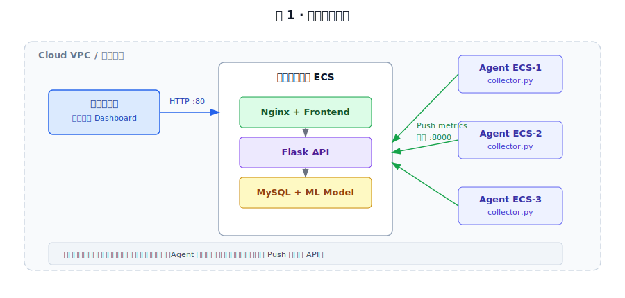
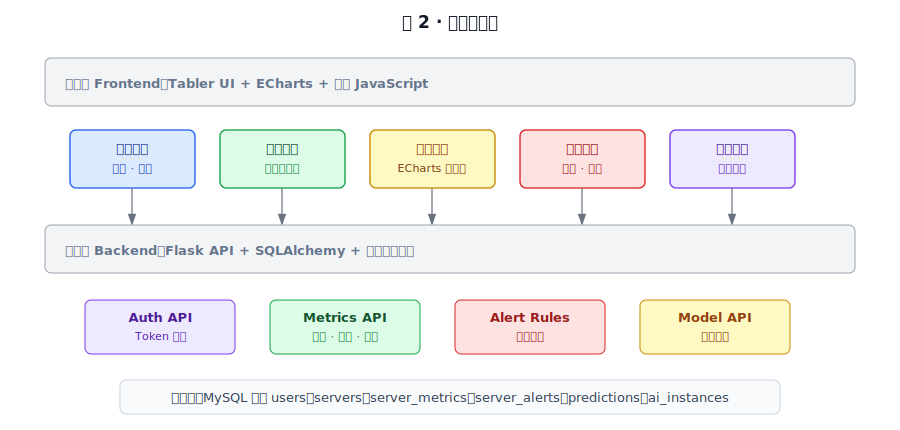
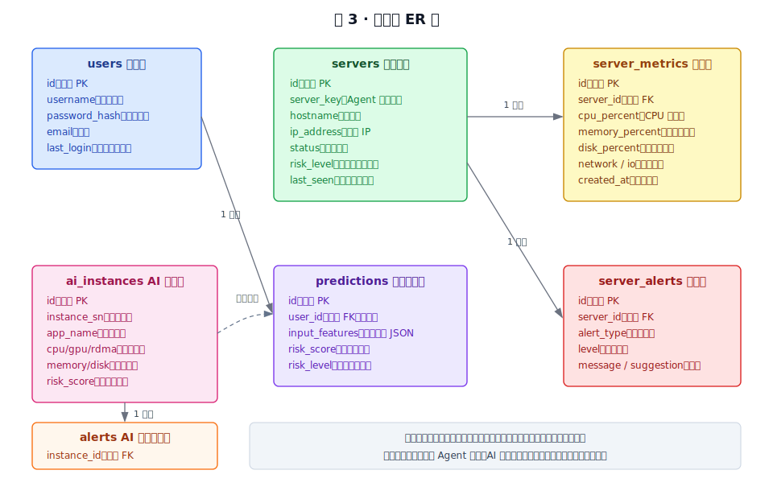
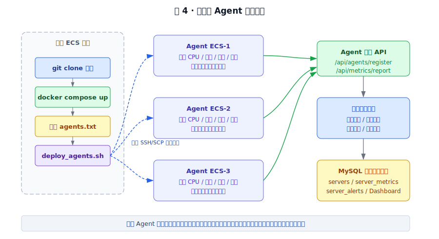
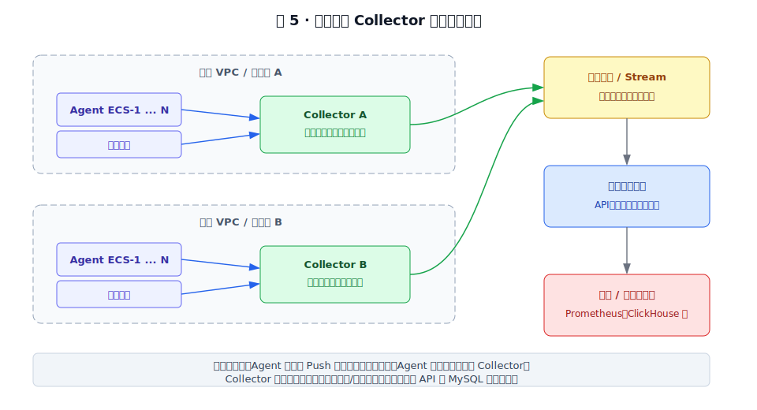

# 基于云平台的服务器运行状态监控与智能预警系统实验报告

> 课程：云计算  
> 技术栈：Flask + MySQL + Docker Compose + Agent Push + ECharts + 机器学习预警  
> 报告说明：本报告按 15 页以内实验报告组织，包含问题分析、解决方案、总体架构图、功能图、关键代码、测试数据与测试结果。转换为 Word 时建议保留本报告中的 SVG 图，并补充程序运行界面截图。

## 1. 项目背景与问题分析

云平台中的服务器和 AI 服务实例通常具有数量多、资源波动快、故障影响范围大的特点。单机命令或临时脚本只能查看当前服务器状态，无法统一管理多台 ECS，也不能沉淀历史指标、告警记录和模型预测结果。课程大作业要求后端提供数据库访问、登录接口、模型接口，前端从数据库获取数据进行图形和表格展示，并能够部署到云端。因此本项目选择实现一个面向云平台服务器与 AI 服务实例的资源运行状态监控、数据分析、告警管理和机器学习预警平台。

本项目需要解决的问题主要包括：

| 问题 | 具体表现 | 本项目处理方式 |
|---|---|---|
| 多台服务器如何接入 | 不可能在每台服务器部署完整 Web 系统 | 中心平台集中部署，被监控 ECS 只运行轻量 Agent |
| 监控数据如何持久化 | 只读实时接口无法满足数据库展示要求 | Agent 指标写入 MySQL，前端再从 MySQL 查询 |
| 如何判断异常 | 原始 CPU、内存数值不直接等于故障结论 | 后端按阈值生成风险等级和处理建议 |
| 如何体现智能预警 | 只做阈值告警不足以体现模型接口 | 使用 Alibaba Cluster Trace v2025 训练资源风险模型 |
| 如何便于云端演示 | 手动逐台配置 Agent 效率低 | 主 ECS 使用脚本通过内网 SSH/SCP 批量分发 Agent |

## 2. 解决方案

系统采用“中心监控平台 + 多 Agent 节点 + MySQL 数据库”的架构。中心 ECS 部署 Flask API、MySQL 和前端页面；其他 ECS 位于同一 VPC 内网，只运行 Python Agent。Agent 每 3 秒采集本机 CPU、内存、磁盘、Swap、网络、磁盘 IO、进程数等指标，并通过 Push 模式上报中心 API。中心 API 将服务器信息、时序指标和告警写入 MySQL，前端再通过接口读取数据库内容并使用 ECharts 展示。

AI 服务实例的智能预警部分使用 Alibaba Cluster Trace v2025 数据集。数据集用于训练和验证模型，不作为首页实时监控的直接展示数据。系统将 Trace 中的实例资源请求、资源上限、调度延迟、运行时长等特征导入 MySQL，并训练风险分类模型。前端智能预警页面调用 `/api/model/predict` 接口，得到风险等级、风险原因和优化建议。

## 3. 总体架构设计



架构分为四层：

| 层次 | 组成 | 作用 |
|---|---|---|
| 前端展示层 | Tabler UI、ECharts、原生 JavaScript | 登录、服务器列表、趋势图、告警表、智能预警页面 |
| 后端服务层 | Flask、SQLAlchemy、模型接口 | 认证、数据库访问、Agent 接入、告警判断、模型预测 |
| 数据存储层 | MySQL 8.0 | 保存用户、服务器、指标、告警、AI 实例和预测历史 |
| 采集层 | Python Agent、psutil、requests | 采集 ECS 实机运行指标并周期性上报 |

系统公网只需要暴露中心 ECS 的 Web 访问入口。Agent 节点通过内网访问中心 API，减少公网暴露面，也符合实际云平台监控系统的部署方式。

## 4. 功能模块设计



| 模块 | 功能 |
|---|---|
| 用户认证 | 注册、登录、Token 会话校验 |
| Agent 接入 | Agent 注册、服务器在线状态维护、上报鉴权 |
| 实时监控 | 多 ECS 指标采集、最新状态展示、趋势查询 |
| 告警管理 | CPU、内存、磁盘、Swap 阈值判断和告警入库 |
| 数据分析 | 服务器列表、趋势图、风险统计、告警队列 |
| 智能预警 | 调用机器学习模型预测 AI 服务资源配置风险 |
| 部署运维 | Docker Compose 部署中心平台，脚本批量分发 Agent |

## 5. 数据库设计

数据库采用 MySQL 8.0。运行时监控数据主要由 `servers`、`server_metrics`、`server_alerts` 三张表组成；AI 服务实例和机器学习预测由 `ai_instances`、`alerts`、`predictions` 等表支持。



核心表说明：

| 表名 | 说明 | 主要字段 |
|---|---|---|
| `users` | 用户登录信息 | username、password_hash、last_login |
| `servers` | 被监控服务器基础信息 | hostname、ip_address、status、risk_level、last_seen |
| `server_metrics` | 服务器时序指标 | cpu_percent、memory_percent、disk_percent、network、io、created_at |
| `server_alerts` | 服务器告警事件 | alert_type、level、message、suggestion、status |
| `ai_instances` | AI 服务实例样本 | cpu/gpu/rdma/memory/disk request-limit、risk_score |
| `alerts` | AI 实例离线风险告警 | instance_id、level、message |
| `predictions` | 模型调用历史 | input_features、risk_score、risk_level、reasons |

其中 `server_metrics` 是前端趋势图和表格展示的主要数据来源，满足“前端获取数据库中的数据进行各种展示”的要求。

## 6. 实验数据

实验数据分为两类：

| 数据类型 | 来源 | 用途 |
|---|---|---|
| 服务器运行指标 | Agent 使用 psutil 从 ECS 实机采集 | 实时监控、趋势图、告警中心 |
| AI 服务实例数据 | Alibaba Cluster Trace v2025 | 模型训练、资源画像、智能预警 |

服务器指标样例：

| 字段 | 示例值 | 说明 |
|---|---:|---|
| cpu_percent | 81.33 | CPU 使用率 |
| memory_percent | 42.10 | 内存使用率 |
| disk_percent | 58.40 | 磁盘使用率 |
| swap_percent | 0.00 | Swap 使用率 |
| network_recv_mb_s | 0.12 | 网络接收速率 |
| network_send_mb_s | 0.08 | 网络发送速率 |
| disk_read_mb_s | 1.36 | 磁盘读取速率 |
| disk_write_mb_s | 0.51 | 磁盘写入速率 |
| process_count | 184 | 进程数量 |
| risk_level | 预警 | 后端规则判断结果 |

AI 服务实例特征样例：

| 字段 | 示例值 | 说明 |
|---|---:|---|
| cpu_request | 52.47 | CPU 请求量 |
| gpu_request | 0.31 | GPU 请求量 |
| rdma_request | 20.81 | RDMA 请求量 |
| memory_request | 265.82 | 内存请求量 |
| disk_request | 308.29 | 磁盘请求量 |
| schedule_delay | 120.00 | 调度延迟 |
| running_duration | 3600.00 | 运行时长 |

## 7. 关键业务流程

### 7.1 Agent 部署与指标上报



流程说明：

1. 中心 ECS 拉取 GitHub 项目并执行 `docker compose up -d --build`。
2. 中心 ECS 准备 `scripts/agents.txt`，填写三台 Agent ECS 的内网 IP 和 SSH 用户。
3. 执行 `scripts/deploy_agents.sh`，通过内网 SSH/SCP 分发 Agent。
4. 每台 Agent 以 systemd 服务运行，执行相同的采集、注册、心跳和上报逻辑。
5. 中心 API 接收指标，写入 MySQL，并根据阈值生成告警。
6. 前端从数据库读取服务器、指标、告警和预测历史进行展示。

### 7.2 告警判断规则

| 指标 | 预警阈值 | 高危阈值 | 建议 |
|---|---:|---:|---|
| CPU | 75% | 90% | 检查高 CPU 进程或降低任务并发 |
| 内存 | 80% | 90% | 释放无用进程或增加内存规格 |
| 磁盘 | 80% | 90% | 清理日志、缓存或扩容磁盘 |
| Swap | 30% | 60% | 检查内存压力，避免频繁换页 |

## 8. 关键代码

### 8.1 Agent 主循环

Agent 常驻运行，每轮采集本机指标；若尚未注册，则先调用注册接口，之后周期性上报指标。

```python
def main() -> None:
    server_id = None
    while True:
        try:
            payload = collect_local_metrics(center_host())
            if not server_id:
                registered = post("/api/agents/register", payload["server"])
                server_id = registered["server_id"]
            report = {
                "server_id": server_id,
                "server": payload["server"],
                "metric": payload["metric"],
            }
            post("/api/metrics/report", report)
        except Exception:
            server_id = None
        time.sleep(INTERVAL)
```

### 8.2 实机指标采集

后端和 Agent 共用 `collect_local_metrics`，使用 psutil 获取 CPU、内存、磁盘、网络、IO 和进程数量。

```python
def collect_local_metrics(center_host: str | None = None) -> dict:
    cpu_percent = psutil.cpu_percent(interval=0.1)
    virtual_memory = psutil.virtual_memory()
    swap_memory = psutil.swap_memory()
    disk_usage = psutil.disk_usage("/")
    level, reasons, suggestions = assess_host(
        cpu_percent,
        virtual_memory.percent,
        disk_usage.percent,
        swap_memory.percent,
    )
    return {
        "server": {
            "hostname": socket.gethostname(),
            "ip_address": local_ip(center_host),
            "cpu_cores": psutil.cpu_count(logical=True),
        },
        "metric": {
            "cpu_percent": round(cpu_percent, 2),
            "memory_percent": round(virtual_memory.percent, 2),
            "disk_percent": round(disk_usage.percent, 2),
            "swap_percent": round(swap_memory.percent, 2),
            "process_count": len(psutil.pids()),
            "risk_level": level,
        },
    }
```

### 8.3 指标入库和告警生成

中心 API 接收 Agent 上报后写入 `server_metrics`，并生成 `server_alerts`。

```python
@bp.post("/metrics/report")
def report_metric():
    if not agent_allowed():
        return jsonify({"detail": "Agent token 无效"}), 401
    payload = request.get_json(silent=True) or {}
    db = SessionLocal()
    try:
        server_payload = payload.get("server") or {}
        metric_payload = payload.get("metric") or payload
        server = db.get(Server, payload.get("server_id")) if payload.get("server_id") else None
        if not server:
            server = upsert_server(db, server_payload)
        metric = save_metric(db, server, metric_payload)
        db.commit()
        return jsonify({
            "metric_id": metric.id,
            "server_id": server.id,
            "risk_level": metric.risk_level,
        })
    finally:
        db.close()
```

### 8.4 模型预测接口

前端智能预警页面调用模型接口，后端保存预测历史。

```python
@bp.post("/predict")
@auth_required
def predict():
    features_dict = prediction_payload(request.get_json(silent=True) or {})
    result = assess_risk(features_dict)
    if settings.model_path.exists():
        model = joblib.load(settings.model_path)
        row = pd.DataFrame([enrich_features(features_dict)])
        ml_level = str(model.predict(row)[0])
    prediction = Prediction(
        user_id=g.current_user.id,
        input_features=features_dict,
        risk_score=result.risk_score,
        risk_level=ml_level or result.risk_level,
        reasons=result.reasons,
        suggestions=result.suggestions,
    )
```

## 9. 实验步骤

### 9.1 本地开发环境运行

后端：

```powershell
cd D:\PyCharmCommunity\Cloud_Computing
$env:PYTHONPATH=(Resolve-Path .\backend).Path
python -m flask --app app.main run --host 0.0.0.0 --port 8000
```

前端：

```powershell
python -m http.server 8080 -d frontend
```

浏览器访问：

```text
http://127.0.0.1:8080
```

默认账号：

```text
admin / admin123
```

### 9.2 云端部署流程

云端演示使用 4 台同一 VPC 内的 Ubuntu ECS：1 台中心 ECS 带公网 IP，3 台 Agent ECS 仅使用内网 IP。中心 ECS 统一部署在 `/root/cloud-ai-monitor`。

中心平台部署：

```bash
apt update
apt install -y docker.io docker-compose git openssh-client sshpass
systemctl enable --now docker
cd /root
git clone https://github.com/uMemory/Cloud_Computing_Project.git cloud-ai-monitor
cd /root/cloud-ai-monitor
docker-compose up -d --build
docker-compose exec backend python backend/scripts/import_trace.py
docker-compose exec backend python backend/ml/train.py
```

Agent 节点列表与免密 SSH：

```bash
cat > scripts/agents.txt <<'EOF'
AGENT1_PRIVATE_IP
AGENT2_PRIVATE_IP
AGENT3_PRIVATE_IP
EOF

test -f /root/.ssh/id_ed25519 || ssh-keygen -t ed25519 -N '' -f /root/.ssh/id_ed25519
export ROOT_PASSWORD='admin321.'
for h in $(cat scripts/agents.txt); do
  sshpass -p "$ROOT_PASSWORD" ssh-copy-id -o StrictHostKeyChecking=no root@$h
done
```

Agent 分发与演示负载：

```bash
chmod +x scripts/deploy_agents.sh scripts/deploy_load_simulators.sh scripts/stop_load_simulators.sh
CENTER_IP=CENTER_PRIVATE_IP AGENT_TOKEN=cloud-monitor-agent-token bash scripts/deploy_agents.sh scripts/agents.txt
bash scripts/deploy_load_simulators.sh scripts/agents.txt
```

`CENTER_PRIVATE_IP` 替换为中心 ECS 内网 IP。Agent 每 3 秒上报一次指标；演示负载脚本会为三台 Agent 下发不同强度 profile，使 CPU、内存、磁盘 IO 曲线更适合录屏展示。前端首页也提供“启动模拟负载 / 停止模拟负载”按钮，按钮通过后端 `/api/ops/load/start` 与 `/api/ops/load/stop` 控制三台 Agent 的 `cloud-monitor-load` systemd 服务。

## 10. 程序运行结果与测试

### 10.1 接口功能测试

| 测试项 | 输入/操作 | 预期结果 | 实际结果 |
|---|---|---|---|
| 登录接口 | admin / admin123 | 返回 Token 并进入系统 | 通过 |
| Agent 注册 | 上报 hostname、ip_address | `servers` 新增或更新记录 | 通过 |
| 指标上报 | 上报 CPU、内存、磁盘等指标 | `server_metrics` 写入记录 | 通过 |
| 告警生成 | CPU ≥ 75% 或磁盘 ≥ 80% | `server_alerts` 生成预警 | 通过 |
| 告警处理 | 确认、解决、忽略、重置 | `server_alerts.status` 写入 MySQL | 通过 |
| 趋势查询 | `/api/metrics/trend?limit=40` | 返回最近 40 条时序指标 | 通过 |
| 服务器列表 | `/api/servers` | 返回在线状态和最新指标 | 通过 |
| 模拟负载 | 启动 `cloud-monitor-load` | 三台 Agent 产生差异化资源波动 | 通过 |
| 模型预测 | 输入资源请求和限制 | 返回 risk_score、risk_level | 通过 |
| 预测历史 | `/api/model/history` | 返回当前用户预测记录 | 通过 |

### 10.2 页面展示测试

| 页面 | 测试内容 | 结果 |
|---|---|---|
| 登录页 | 输入账号密码、记住用户名、显示密码 | 正常 |
| 监控首页 | 指标卡片、趋势图、服务器状态 | 正常 |
| 服务器列表 | 多台 ECS 最新状态、内网 IP、风险等级 | 正常 |
| 告警中心 | 告警类型、等级、建议、处理状态 | 正常 |
| 智能预警 | 输入资源参数并调用模型接口 | 正常 |
| 预测历史 | 展示模型调用历史 | 正常 |

转换为 Word 时建议插入以下运行截图：

1. 登录界面截图。
2. 监控首页截图，展示服务器总数、在线数、告警数和趋势图。
3. 服务器列表截图，展示多台 ECS 的内网 IP 和最新指标。
4. 告警中心截图，展示预警或高危记录。
5. 智能预警页面截图，展示模型预测输入和输出。

### 10.3 测试数据与结果分析

测试时使用 1 台中心 ECS 和 3 台 Agent ECS。Agent 默认每 3 秒上报一次指标，中心平台写入 MySQL 后前端自动刷新。为避免空闲 ECS 曲线过直，测试时启动了轻量模拟负载，使三台 Agent 呈现不同幅度的 CPU、内存和磁盘 IO 波动。观察到如下结果：

| 场景 | 测试数据 | 结果分析 |
|---|---|---|
| 正常负载 | CPU 约 10%~40%，内存约 30%~60% | 风险等级为正常，不生成告警 |
| CPU 压力 | CPU 超过 75% | 风险等级变为预警，告警中心出现 CPU 预警 |
| 磁盘压力 | 磁盘使用率超过 80% | 告警中心出现磁盘容量预警 |
| Agent 离线 | 停止 Agent 超过 30 秒 | 服务器列表状态变为 offline |
| 告警处理闭环 | 将告警置为已确认或已解决 | 状态保存到 MySQL，刷新后仍保持 |
| 模型预测 | 输入高资源密度 AI 实例 | 返回较高 risk_score，并给出优化建议 |

## 11. 不足与扩展方向

当前系统适合课程演示和中小规模 ECS 集群。由于采用单中心 API 和 MySQL 存储高频指标，大规模场景下会受到中心写入能力、数据库时序数据容量、单 VPC 网络规模和单点故障的限制。



在大型云平台中，Agent 不宜全部直接上报到单个中心 API。更合理的方式是在不同 VPC、可用区或业务集群中部署 Collector。Agent 先将数据 Push 到本区域 Collector，Collector 负责局部缓存、批量压缩、失败重试和初步聚合，再将数据写入消息队列或上报中心平台。中心平台只处理聚合后的数据流，并将高频时序数据写入专门的时序或分析型数据库。

后续可扩展方向：

1. 引入分层 Collector，按 VPC、可用区或业务组汇聚 Agent 数据。
2. 使用 Kafka、RabbitMQ 或 Redis Stream 削峰，避免高并发上报直接冲击数据库。
3. 将高频时序指标迁移到 Prometheus、VictoriaMetrics、InfluxDB 或 ClickHouse。
4. 后端 API 横向扩展，前置负载均衡。
5. 增加告警通知渠道，如邮件、企业微信、钉钉或短信。
6. 增强模型训练流程，加入定期重训、模型评估指标和版本管理。

## 12. 总结

本项目围绕云平台服务器与 AI 服务实例监控场景，实现了登录认证、数据库访问、多 ECS Agent 指标采集、MySQL 持久化、趋势图展示、告警管理和机器学习预警功能。系统采用中心平台集中部署、Agent 节点轻量接入的方式，既便于云端演示，也符合实际监控系统的基本架构。整体实现满足课程对后端、数据库、前端、模型接口、数据可视化、云端部署和实验报告的要求。
